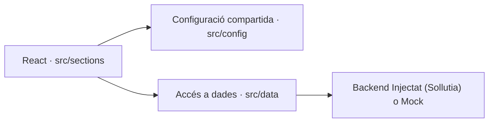
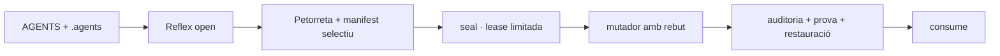

# Arquitectura tècnica unificada

Este document és un mapa explicatiu, no una autorització d'execució. Quan discrepe amb el repositori, prevalen `AGENTS.md`, `.agents/`, el codi i les proves. Cada afirmació usa un nivell d'evidència:

- **Implementat:** existeix al codi o a la configuració actual i es pot verificar.
- **Contracte:** decisió vigent que tot canvi nou ha de respectar.
- **Futur:** hipòtesi o línia d'investigació; no es pot usar com si ja funcionara.

## 1. Arquitectura implementada

La base actual de `socdepoble.org` és una aplicació web React construïda amb Vite. Les dependències declarades inclouen Lucide. La capa `src/data/` delega el backend al host o a implementacions mock. Cada garantia concreta s'ha de demostrar amb una prova.

Contractes de localització del codi:

1. Una funció específica d'una secció viu en `src/sections/<seccio>/`.
2. La configuració transversal viu en `src/config/`.
3. La lectura, escriptura i fallback de dades viuen en `src/data/`.
4. Una capacitat offline només es declara operativa quan té prova de desconnexió, persistència i recuperació.
5. El Baseline 2022 és el sòl de compatibilitat; una API disponible al baseline s'usa directament, sense detecció ni fallback (vegeu `.agents/BASELINE.md`).

## 2. Estat de les tecnologies descentralitzades

La descentralització, el P2P i la resiliència rural formen part de la visió de [[el_projecte]]. No formen part automàticament de l'estat implementat.

| Capacitat | Estat en esta baseline | Condició per promoure-la |
|---|---|---|
| Persistència local amb Dexie | Futur; no és dependència actual | Tests per flux i política de migració |
| Supabase amb fallback local | Futur | Tests d'error, reconciliació i pèrdua de xarxa |
| PWA/Workbox | Futur; no és dependència actual | Prova instal·lable i d'actualització en dispositiu objectiu |
| Y.js o un altre CRDT | Futur; no és dependència actual | ADR, prototip, proves de convergència i límits de GC |
| WebRTC/P2P remot | Futur | Signaling, identitat, xifratge, NAT i proves multi-dispositiu |
| OPFS | Futur | Compatibilitat Safari, migració i fallback |
| PowerSync | Futur; no és dependència actual | ADR i integració demostrable |
| LoRa/Meshtastic, drons o satèl·lit | Recerca | Prototip físic, pressupost, legalitat i model d'amenaça |
| Xifrat homomòrfic o postquàntic | Recerca | Cas d'ús, revisió criptogràfica i implementació auditada |

No existeixen en esta baseline `MassiveFusionEngine`, `sync-wiki-crdt.js`, `dron_link_protocol.js` ni una malla Y.js operativa. Els noms històrics poden orientar un experiment, però no són API, control de seguretat ni criteri d'acceptació.

## 3. Contracte de la Wiki

La Wiki és un vault de Markdown governat per fitxers, Git i l'Acte Reflex; no és una base CRDT.

- L'esquema únic de frontmatter és `tooling/wiki/schema.json`.
- El graf operatiu usa els quatre pilars `00_SER`, `01_SABER`, `02_ACTUAR` i `03_GOVERNAR`.
- `04_ARXIU` i `05_Escriptori` són zones de cicle de vida, no pilars nous.
- Els paquets massius i les Mega-Petorretas viuen fora del vault, en `_arxiu_wiki_de_poble/`.
- Un orfe amb contingut no s'elimina ni es mou automàticament. Només un fitxer físicament buit, sense arestes i amb pla reversible pot entrar en quarantena.
- El protocol autoritatiu és `.agents/PROTOCOL_PETORRETA.md`; esta pàgina només l'explica.

## 4. Arquitectura cognitiva

L'agent no carrega tot l'historial ni tota la Wiki. Comença per l'autoritat mínima i amplia el context segons la tasca:

1. `AGENTS.md` i les normes `.agents/` aplicables.
2. Codi, proves i configuració que acrediten l'estat real.
3. Pàgines canòniques estrictament relacionades.
4. Arxiu o documentació de proveïdor només quan la pregunta ho requerix.

El manifest de context registra `path`, `reason`, `classification` i `role`. Una afirmació sense font, fórmula o prova és una hipòtesi; una mètrica sense denominador i finestra temporal no és una mètrica operativa.

## 5. Criteris per a madurar una tecnologia futura

Una idea passa de **Futur** a **Implementat** només quan té:

1. un problema i un propietari explícits;
2. una decisió d'arquitectura amb alternatives i cost de reversió;
3. codi localitzable i configuració reproduïble;
4. proves d'èxit, fallada i recuperació en el dispositiu objectiu;
5. model de dades, privacitat i amenaces;
6. observabilitat amb fórmules i llindars justificats;
7. documentació actualitzada en la mateixa operació.

Fins que es complisquen els set punts, Antigravity ha de dir «proposat» o «no verificat», mai «curat», «blindat» o «100% operatiu».

## Relacions

- [[00_index|Índex de la Wiki]]
- [[02_genotip|Genotip cognitiu]]
- [[PROTOCOL_PETORRETA|Petorretas i context selectiu]]
- [[sdp_lock|Límits de seguretat]]
- [[00_visio_i_pilars|Visió i pilars]]

### Skills Operatives (Autosanació i Execució)
- [[auditoria_canonica]]
- [[MOTOR_OFFLINE]]
- [[a11y_seo_trellat]]
- [[futur_adaptacio]]
- [[index_trellat]]
- [[seguretat_execucio]]
- [[self_repair]]
- [[successio_lazaro_execucio]]

### Eines d'Obsidian (Plugins i Workflow)
- [[homepage]]
- [[plugins]]

**Ancoratge de Seguretat:** [[00_index]]

